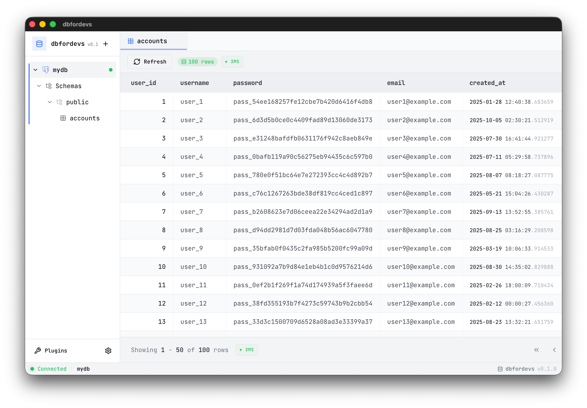

# dbfordevs

[](https://tauri.app/)
[](https://reactjs.org/)
[](https://www.rust-lang.org/)
[](https://bun.sh/)

**dbfordevs** is a modern, lightweight, cross-platform database management application designed specifically for developers. Built with **Tauri 2.0**, **React**, and **Rust**, it focuses on speed, security, and a superior developer experience.

<p align="center">
  <picture>
    <source media="(prefers-color-scheme: dark)" srcset="docs/images/dbfordevs_dark.png">
    
  </picture>
</p>

## 🚀 Key Features

- **Unified Interface:** Manage PostgreSQL, MySQL, MSSQL, SQLite, MongoDB, and Redis from a single app.
- **Lightweight & Fast:** Minimal memory footprint (< 200MB) and near-instant startup.
- **Visual Diff Preview:** Review all data changes before committing them to the database.
- **Side Panel Editor:** High-performance data grid with a comfortable side-panel for editing complex records.
- **AI-Powered Assistance:** Built-in AI assistant to generate, explain, and optimize SQL queries using Claude, GPT, or Gemini.
- **Multiple Themes:** Choose from Light, Dark, Nordic Dark, Nordic Light, or System auto-switching.

## 🛠️ Tech Stack

- **Frontend:** React 18+, TypeScript, Vite, TailwindCSS, shadcn/ui
- **Backend:** Rust, Tauri 2.x
- **State Management:** Zustand
- **Database Drivers:** SQLx (PostgreSQL, MySQL, SQLite, MSSQL), MongoDB, Redis
- **Package Manager:** Bun

## 📁 Project Structure

```text
dbfordevs/
├── src/                    # React frontend
│   ├── components/         # UI components
│   ├── lib/ai/             # Built-in AI assistant
│   ├── stores/             # Zustand state management
│   └── hooks/              # React hooks
├── src-tauri/              # Tauri application core (Rust)
│   ├── src/commands/       # Tauri IPC command handlers
│   └── src/db/             # Database drivers (PostgreSQL, MySQL, SQLite)
├── public/                 # Static assets
└── docs/                   # Project documentation & PRD
```

## 📖 Documentation

For more detailed information, please refer to the documentation in the `docs/` folder:

- **[Getting Started](docs/GETTING_STARTED.md)**: Installation and first steps.
- **[User Guide](docs/USER_GUIDE.md)**: Comprehensive guide on using the application.
- **[Architecture](docs/ARCHITECTURE.md)**: Technical details about the system.
- **[Graphite Workflow](docs/GRAPHITE.md)**: Guide for developers on using Graphite for stacked PRs.

## 🚦 Getting Started

### Prerequisites

- **Rust:** Install via [rustup](https://rustup.rs/)
- **Bun:** Install via [bun.sh](https://bun.sh/)
- **Tauri Dependencies:** Follow the [Tauri setup guide](https://tauri.app/v1/guides/getting-started/prerequisites) for your OS.

### Installation

1. Clone the repository:
   ```bash
   git clone https://github.com/dschwarz/dbfordevs.git
   cd dbfordevs
   ```

2. Install dependencies:
   ```bash
   bun install
   ```

3. Run in development mode:
   ```bash
   bun tauri dev
   ```

### Building for Production

```bash
bun tauri build
```

## 📄 License

This project is licensed under the **MIT License**. See the [LICENSE](LICENSE) file for details.

---

Built with ❤️ by Daniels

